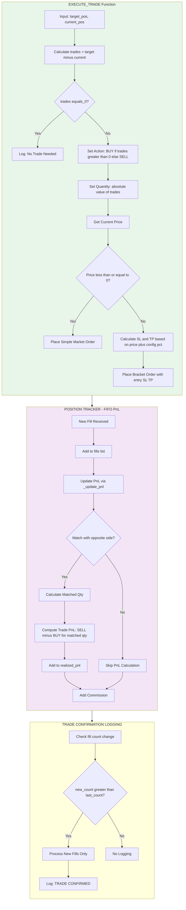
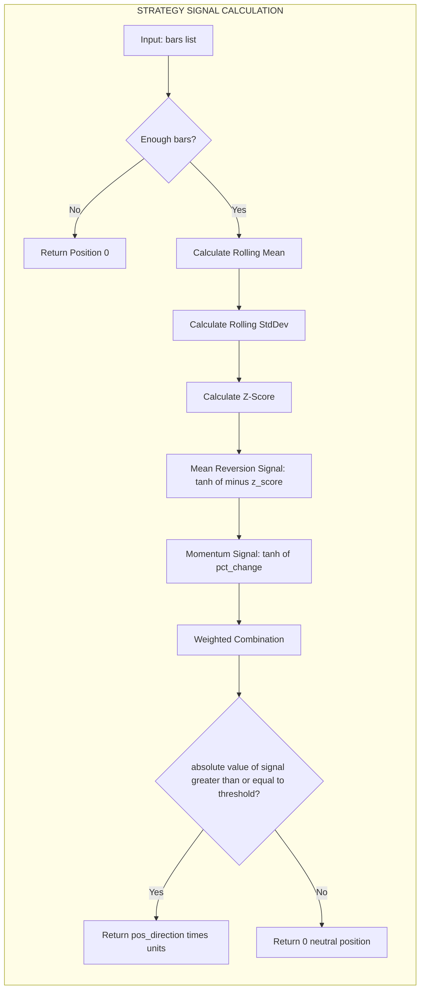

# Order Execution Decision Tree

This diagram illustrates the order execution flow during a trading session, mapping decisions, branches, and outcomes from the trading logic in `src/strategies/main.py`.

## Session Lifecycle Flow

```mermaid
flowchart TB
    subgraph Initialization["1. SESSION INITIALIZATION"]
        direction TB
        A[Start run_session] --> B[Load Config]
        B --> C[Connect to IBKR]
        C --> D[Create Contract]
        D --> E[Create Strategy]
        E --> F[Fetch Historical Bars
        2 days initially]
        F --> G[Initialize PositionTracker
        FIFO fill tracking]
    end

    subgraph PreSession["2. PRE-SESSION SETUP"]
        direction TB
        H[Set Session Start Time] --> I[Calculate Session End
        start + duration_hours]
        I --> J[Get Initial Position
        from IBKR]
        J --> K[Compute Initial Target
        via StrategyExecutor]
        K --> L{Position Check}
        L -->|target != current| M[Execute Initial Trade
        bracket or market order]
        L -->|target == current| N[No Trade Needed]
    end

    subgraph MainLoop["3. MAIN TRADING LOOP"]
        direction TB
        O[Loop Every 5 Seconds] --> P{End Time Reached?}
        P -->|Yes| Q[Exit Loop]
        P -->|No| R[Fetch Latest Bars
        1 day duration]
        R --> S[Update TradingState]
        S --> T[Compute New Target
        via Strategy.calculate_position]
        T --> U{Target Changed?}
        U -->|Yes| V[Execute Trade]
        U -->|No| W[Skip Execution]
        V --> X[Check for New Fills]
        W --> X
        X --> Y{New Fills?}
        Y -->|Yes| Z[Log Trade Confirmed
        Update PnL via FIFO]
        Y -->|No| O
        Z --> O
    end

    subgraph Termination["4. SESSION TERMINATION"]
        direction TB
        AA[Close All Positions] --> BB[Sell to Zero]
        BB --> CC[Wait 10 Seconds
        for final fills]
        CC --> DD[Process Remaining Fills]
        DD --> EE[Log Final Report]
        EE --> FF[Log Net PnL]
        FF --> GG[Disconnect IBKR]
        GG --> HH[End Session]
    end

    Initialization --> PreSession
    PreSession --> MainLoop
    MainLoop --> Termination

    style Initialization fill:#e1f5fe
    style MainLoop fill:#fff3e0
    style Termination fill:#ffebee
```

## Detailed Order Execution Branch

## Strategy Signal Generation (TanhStrategy Example)

## Key Decision Points Summary

| Decision Point | Location | Condition | True Action | False Action |
|----------------|----------|-----------|-------------|--------------|
| Initial Trade | Pre-session | `target != current_pos` | Execute bracket/market order | No trade needed |
| Loop Continuation | Main loop | `datetime >= session_end` | Exit to termination | Continue trading |
| Target Changed | Main loop | `target != current_pos` | Execute trade | Skip execution |
| New Fills | Main loop | `new_fill_count > last_fill_count` | Log confirmation, update PnL | No logging |
| Price Valid | execute_trade | `current_price <= 0` | Simple market order | Bracket order with SL/TP |
| Close Position | Termination | Always | Execute sell to zero | - |

## Trade Execution Outcomes

### Order Types Used
1. **Bracket Order** (when price > 0): Entry + Stop Loss + Take Profit
2. **Market Order** (when price <= 0 or position close): Immediate execution

### Position Values
- `-10`: Short position (sell)
- `0`: Neutral/flat
- `+10`: Long position (buy)

### PnL Calculation Method
- **FIFO matching**: New fills matched against opposite-side fills in order received
- **Realized PnL**: Calculated only on closed positions (matched quantities)
- **Commission**: Tracked separately per fill
- **Net PnL**: Realized PnL - Total Commissions
